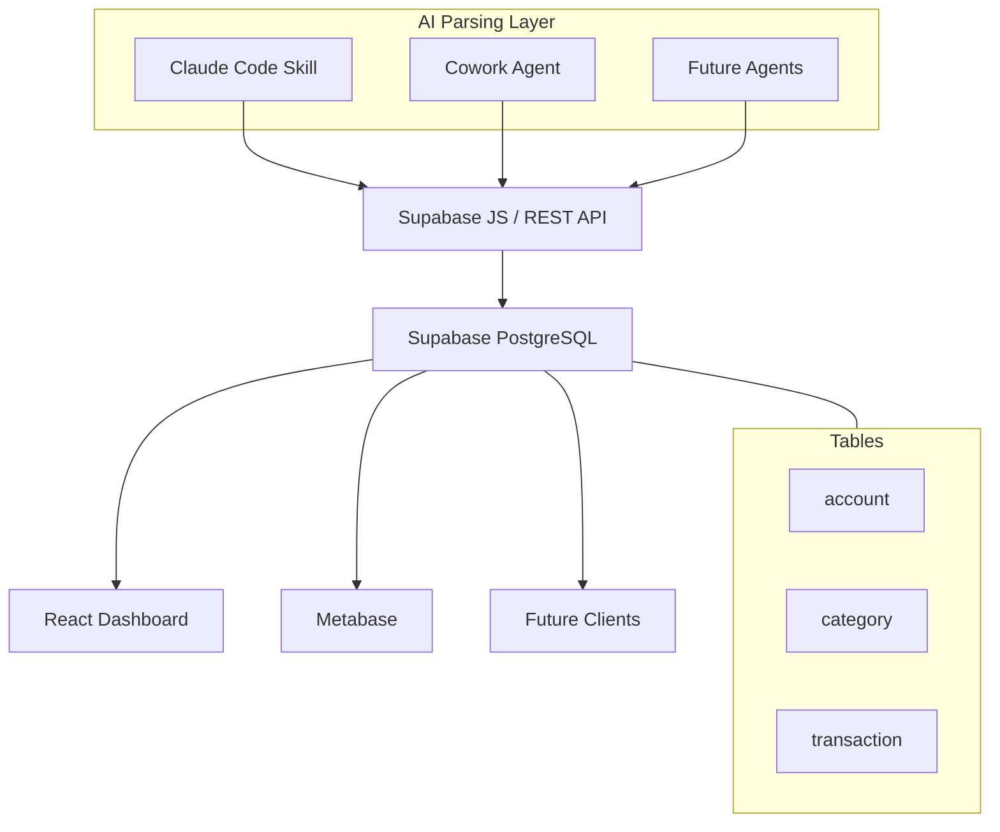

# Grana AI — Product Spec

**Version:** 1.0 | March 2026
**Status:** Draft

---

## Purpose

Grana AI is a personal finance tracker that showcases AI-powered document parsing across multiple agent surfaces. The core loop: AI parses bank statements → inserts structured data into Supabase → dashboards display the data.

The product is intentionally simple. The showcase value is the multi-agent architecture — the same database is populated by different AI interfaces (Claude Code skill, Claude Cowork, potentially other agents), proving that a well-structured schema enables diverse AI-powered workflows.

---

## Architecture

---

## Database Schema

Already deployed in Supabase. Three tables, two enums.

### Enums

| Enum | Values |
|------|--------|
| `account_type` | `checking`, `savings`, `credit_card`, `investment` |
| `transaction_status` | `pending`, `approved`, `rejected` |

### Tables

**`account`** — Bank accounts and credit cards.

| Column | Type | Notes |
|--------|------|-------|
| `id` | uuid PK | Auto-generated |
| `name` | text | e.g. "Nubank Checking", "Itaú Visa" |
| `type` | account_type | |
| `created_at` | timestamptz | |
| `updated_at` | timestamptz | Auto-trigger |

**`category`** — Transaction categories. Pre-seeded with 14 categories in Portuguese.

| Column | Type | Notes |
|--------|------|-------|
| `id` | uuid PK | Auto-generated |
| `name` | text | Unique |
| `created_at` | timestamptz | |

Seed values: Alimentação, Moradia, Contas e Utilidades, Transporte, Saúde, Educação, Assinaturas, Vestuário, Impostos e Taxas, Transferências Pessoais, Cartão de Crédito, Financiamentos, Receitas, Outros.

**`transaction`** — Every parsed line from a bank statement becomes a row.

| Column | Type | Notes |
|--------|------|-------|
| `id` | uuid PK | Auto-generated |
| `date` | date | Transaction date |
| `description_raw` | text | Original text from statement |
| `description_clean` | text | AI-cleaned/normalized description |
| `amount` | decimal(12,2) | Negative = expense, positive = income |
| `account_id` | uuid FK → account | |
| `category_id` | uuid FK → category | Nullable |
| `status` | transaction_status | Default `approved` |
| `statement_hash` | text | Nullable. For dedup on banks that provide unique IDs |
| `created_at` | timestamptz | |
| `updated_at` | timestamptz | Auto-trigger |

### Deduplication

Two partial unique indexes:

- **With hash** (e.g. Nubank checking): unique on `(account_id, statement_hash)` where hash is not null
- **Without hash** (e.g. credit cards): unique on `(account_id, date, amount, description_raw)` where hash is null

Agents can safely re-parse and upsert the same statement without creating duplicates.

---

## AI Parsing Layer

### Supported Formats (v1)

| Format | Source | Notes |
|--------|--------|-------|
| OFX | Most Brazilian banks (Itaú, Bradesco, BB, Santander) | Structured XML |
| CSV | Nubank, Inter | Semi-structured, header variations |
| PDF | Credit card statements | Unstructured — the hard showcase piece |

### What the AI Does Per Statement

1. Identifies the bank and account type from the file format/content
2. Parses each transaction line: date, raw description, amount
3. Cleans descriptions (normalizes merchant names, removes noise)
4. Categorizes each transaction against the existing category list
5. Generates `statement_hash` where the bank provides unique IDs
6. Upserts into Supabase

### Agent Surfaces

**Claude Code Skill** — Primary parsing engine. User drops a statement file, skill reads/parses/inserts. Already built.

**Claude Cowork** — Interactive flow. User drops a file, Cowork parses and can ask clarifying questions about ambiguous categorizations.

**Future agents** — Schema is agent-agnostic. Any tool that can hit the Supabase API can write transactions (WhatsApp bot, Telegram bot, cron-based auto-importer).

---

## Dashboards

### React Dashboard

A standalone React app connected to Supabase. All UI in Portuguese (pt-BR). Connection credentials via `.env`.

**Views:**

- **Visão mensal** — Total income vs. expenses, net balance, month-over-month trend line
- **Gastos por categoria** — Pie or bar chart of spending by category for selected period
- **Transações** — Filterable/searchable table of all transactions. Sortable by date, amount, category. Filter by account, category, date range.
- **Contas** — Balance summary and transaction count per account

**Design direction:** Clean, minimal, dark mode. Functional tool aesthetic — not a flashy fintech landing page.

### Metabase

Self-hosted Metabase (Docker) connected directly to Supabase's Postgres.

**Dashboards:**

- **Tendência de gastos** — Monthly spending over time (line chart)
- **Heatmap por categoria** — Which categories spike in which months
- **Top comerciantes** — Most frequent/expensive merchants by `description_clean`
- **Receitas vs. despesas** — Monthly comparison with running balance

---

## Scope

### In Scope (v1)

- AI parsing of OFX, CSV, and PDF bank statements
- Claude Code skill (already built)
- Claude Cowork agent
- React dashboard with 4 views, connected to Supabase
- Metabase dashboard connected to Supabase Postgres
- Dedup via existing partial indexes

### Out of Scope

- Multi-user / auth
- Budgets or alerts
- Bank API integrations (Open Finance Brasil)
- Mobile app
- Recurring transaction detection
- Investment tracking

### Maybe Later

- WhatsApp bot for statement parsing
- Auto-categorization rules that learn from corrections
- Export to accounting formats

---

## Showcase Narrative

What this project demonstrates in a portfolio context:

1. **AI agent design** — A skill that parses unstructured financial data into structured records
2. **Multi-agent architecture** — Same schema, multiple AI consumers. The database is the contract, agents are interchangeable.
3. **Framework flexibility** — React dashboard alongside Vue.js products (Nitent, LifeStint)
4. **BI tooling** — Metabase integration shows ability to deploy analytics infrastructure fast
5. **Dogfooding** — It's not a toy demo, it actually tracks real finances

---

*Maintained by: Marco / Aesir Tecnologia*
*Last updated: March 2026*
